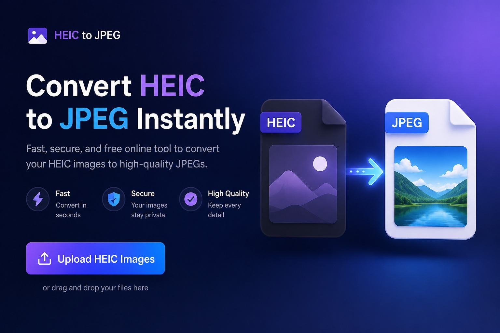

<p align="center">
  
</p>

<p align="center">
  
  
  
  
  
  
</p>

# HEIC to JPG Converter by TCDOVERLORD

A simple Windows tool that converts iPhone HEIC and HEIF photos into JPG copies.

The main rule is simple:

> Read photos from the input location, create JPG files in the output location, and leave the original photos alone.

## What it does

1. You choose one or more HEIC photos, or choose a folder.
2. You choose where the JPG files should go.
3. The converter creates JPG copies.
4. Your original HEIC files remain unchanged.

The program can also scan subfolders, preserve folder structure, handle duplicate file names safely, show progress, and write a log when something fails.

## Current status

- Owner: **TCDOVERLORD**
- Version: **Not assigned by the owner**
- Six-Color phase: **Orange — Local Working Build**
- Local operation: **The owner reports that the converter works**
- Automated foundation tests: **6 passed on July 20, 2026**
- Clean second-computer test: **Not yet documented**
- Digital signing: **Not included**

This is a working local project. It is not being presented as a fully tested public release.

## Simple workflow

```text
HEIC input
    |
    v
Converter
    |
    v
JPG output
```

Example:

```text
Input:
C:\Photos\iPhone\IMG_1001.HEIC

Output:
C:\Photos\JPG Converted\IMG_1001.jpg
```

## Run the converter

### Normal use

Double-click:

```text
RUN_FROM_SOURCE.bat
```

The run script does four things:

1. Checks for Python 3.10 or newer.
2. Creates a private Python environment named `.venv` when needed.
3. Installs the required packages.
4. Opens the converter window.

The first start may take longer because the required packages must be installed. Later starts reuse the same environment.

### Install into the requested folder

Double-click:

```text
INSTALL_TO_REQUESTED_PATH.bat
```

The requested location is:

```text
C:\DevTools\FullBuilds_Unsigned\heic_to_jpg_convert_TCDOVERLORD
```

The installer is designed not to overwrite an existing destination.

## Use the window

1. Click **Add files** or **Add folder**.
2. Choose the HEIC or HEIF photos.
3. Confirm the output folder.
4. Leave the collision setting on **Rename** for the safest behavior.
5. Click **Convert to JPG**.
6. Check the completed, skipped, and failed totals.
7. Open several JPG files before removing photos from any other device.

## Safe output behavior

The default collision mode is **Rename**.

When a JPG name already exists, the converter creates another name:

```text
IMG_1001.jpg
IMG_1001_1.jpg
IMG_1001_2.jpg
```

The converter does not include a feature that deletes the original HEIC photos.

## Build the unsigned Windows program

Double-click:

```text
BUILD_UNSIGNED.bat
```

The build process:

1. Prepares the Python environment.
2. Runs the automated tests.
3. Preserves the previous unsigned build.
4. Creates the Windows executable.
5. Creates a SHA-256 checksum.

Expected output:

```text
build_output\unsigned\HEIC_to_JPG_Converter_TCDOVERLORD.exe
```

The executable is not digitally signed. Windows may show a SmartScreen warning.

## Requirements

- Windows 10 or Windows 11
- Python 3.10 or newer when running from source
- Internet access for the first dependency installation

Main packages:

- Pillow 12.3.0
- pillow-heif 1.1.1
- PyInstaller 6.21.0 for building the executable

## Command-line example

```powershell
.\.venv\Scripts\python.exe .\main.py --cli "C:\Photos" --recursive -o "C:\Photos\JPG Converted"
```

Optional settings include:

```text
--quality 95
--collision rename
--collision skip
--collision overwrite
--no-preserve-timestamps
```

## Logs

Session logs are stored here:

```text
%LOCALAPPDATA%\TCDOVERLORD\HEIC_to_JPG_Converter\logs
```

The application also has an **Open log folder** control.

## Project structure

```text
main.py
src\heic_converter\
tests\
scripts\
docs\
RUN_FROM_SOURCE.bat
BUILD_UNSIGNED.bat
INSTALL_TO_REQUESTED_PATH.bat
README.md
PROJECT_CONTINUITY.md
ANGEL_PROJECT_INFO.md
CHANGELOG.md
LICENSE.md
```

## Documentation

- [User guide](docs/USER_GUIDE.md)
- [Safety guide](docs/SAFETY.md)
- [Architecture](docs/ARCHITECTURE.md)
- [Testing guide](docs/TESTING.md)
- [GitHub setup](docs/GITHUB_SETUP.md)
- [Project continuity](PROJECT_CONTINUITY.md)
- [Contribution guide](CONTRIBUTING.md)
- [Security policy](SECURITY.md)
- [Support](SUPPORT.md)

## Known limits

- Some HEIC containers may contain extra images, depth information, edits, or metadata that are not transferred to JPG.
- The application converts the primary image provided by the decoding library.
- Clean-machine compatibility has not yet been documented.
- Large batches have not been fully stress-tested.
- The executable is unsigned.
- JPG cannot preserve every feature stored inside HEIC.

## License

This repository currently uses a protective TCDOVERLORD Personal Learning License notice.

See [LICENSE.md](LICENSE.md).

Public redistribution or relicensing should not occur until the owner approves the complete license terms.

## Author

**TCDOVERLORD**

Built with the Angel Project engineering workflow.
